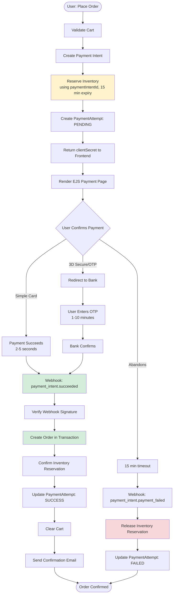
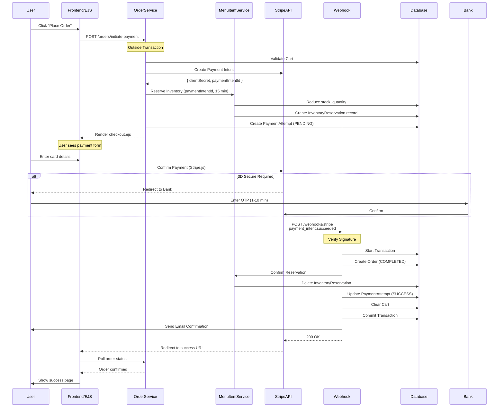

# Payment Gateway Integration - Technical Design Document

**Date:** 2026-02-18  
**Purpose:** Multi-Gateway Payment Integration with Async Webhooks and Inventory Reservation  
**Scope:** Stripe, PayPal, Amadeus, Paymob, Cash on Delivery

---

## 1. Overview

This document outlines the technical design for integrating multiple payment gateways using **Payment Intents API with webhook confirmation and inventory reservation**.

### Key Features
- ✅ Multiple payment providers (Stripe, PayPal, Amadeus, Paymob, COD)
- ✅ **Payment Intents API** (3D Secure, SCA compliance, global banking)
- ✅ **Webhook-based confirmation** (secure, authoritative)
- ✅ **Inventory reservation** (prevents race conditions)
- ✅ **EJS test templates** (reusable for React/Vue)
- ✅ Idempotency protection
- ✅ Provider-agnostic customer management
- ✅ Clean Architecture (Repository/Service pattern)

### Architectural Decision: Webhooks + Inventory Reservation

**Why Webhooks?**
- ✅ **Security**: Only way to securely confirm payment (server-to-server)
- ✅ **3D Secure support**: Handles async authentication (OTP, bank redirects)
- ✅ **Reliability**: Stripe retries failed webhooks
- ✅ **Compliance**: Required for EU PSD2, global banking systems

**Why Inventory Reservation?**
- ✅ **Prevents overselling**: Items held during payment
- ✅ **Fair allocation**: First to pay gets the item
- ✅ **Auto-release**: Expired reservations freed automatically
- ✅ **Transaction safety**: Inventory reduced before order creation

---

## 2. Complete Payment Flow with Inventory Reservation



---

## 3. Detailed Sequence Diagram



---

## 4. Inventory Reservation System

### Database Schema

```prisma
model InventoryReservation {
  reservationId   String   @id @default(uuid()) @map("reservation_id")
  menuItemId      String   @map("menu_item_id")
  quantity        Int      @map("quantity")
  customerId      String   @map("customer_id")
  restaurantId    String   @map("restaurant_id")
  paymentIntentId String   @unique @map("payment_intent_id")
  expiresAt       DateTime @map("expires_at")
  
  createdAt DateTime @default(now()) @map("created_at")
  
  menuItem MenuItem @relation(fields: [menuItemId], references: [menuItemId])
  
  @@index([expiresAt])
  @@index([paymentIntentId])
  @@map("inventory_reservations")
}
```

### Reservation Flow

```typescript
import { menuItemRepository } from '../repositories/menuItem.repository';
import { prisma } from '../config/prisma.config';
import { ConflictError } from '../utils/errors';

// Added to MenuItemService (src/services/menuItem.service.ts)
class MenuItemService {
    // ... existing methods (validateStock, reduceStock, restoreStock, etc.)
    
    async reserveInventory(
        cartItems: CartItemSummary[],
        paymentIntentId: string,
        customerId: string,
        restaurantId: string
    ): Promise<void> {
        const expiresAt = new Date(Date.now() + 15 * 60 * 1000); // 15 minutes
        
        await prisma.$transaction(async (tx) => {
            for (const item of cartItems) {
                // Check stock
                const menuItem = await tx.menuItem.findUnique({
                    where: { menuItemId: item.menuItemId }
                });
                
                if (!menuItem) {
                    throw ConflictError(`Menu item not found`);
                }
                
                if (menuItem.stockQuantity < item.quantity) {
                    throw ConflictError(`${menuItem.menuItemName} is out of stock`);
                }
                
                // Reduce stock immediately
                await tx.menuItem.update({
                    where: { menuItemId: item.menuItemId },
                    data: { stockQuantity: { decrement: item.quantity } }
                });
                
                // Create reservation record
                await menuItemRepository.createReservation({
                    menuItemId: item.menuItemId,
                    quantity: item.quantity,
                    customerId,
                    restaurantId,
                    paymentIntentId,
                    expiresAt
                }, tx);
            }
        });
    }
    
    async confirmReservation(paymentIntentId: string): Promise<void> {
        // Delete reservation records (stock already reduced)
        await menuItemRepository.deleteReservationsByPaymentIntent(paymentIntentId);
    }
    
    async releaseReservation(paymentIntentId: string): Promise<void> {
        const reservations = await menuItemRepository.findReservationsByPaymentIntent(
            paymentIntentId
        );
        
        if (reservations.length === 0) return;
        
        await prisma.$transaction(async (tx) => {
            // Restore stock
            for (const reservation of reservations) {
                await tx.menuItem.update({
                    where: { menuItemId: reservation.menuItemId },
                    data: { stockQuantity: { increment: reservation.quantity } }
                });
            }
            
            // Delete reservation records
            await menuItemRepository.deleteReservationsByPaymentIntent(paymentIntentId, tx);
        });
    }
    
    // Cron job: Release expired reservations
    async releaseExpiredReservations(): Promise<void> {
        const expired = await menuItemRepository.findExpiredReservations();
        
        for (const reservation of expired) {
            await this.releaseReservation(reservation.paymentIntentId);
        }
    }
}

export const menuItemService = new MenuItemService();
```

---

## 5. Order Service Implementation

### Initiate Payment

```typescript
import { cartService } from './cart.service';
import { PaymentStrategyFactory } from './payment/PaymentStrategyFactory';
import { menuItemService } from './menuItem.service';
import { paymentAttemptRepository } from '../repositories/PaymentAttemptRepository';
import { PaymentAttemptStatus } from '../generated/prisma/client';
import { NotFoundError, BadRequestError } from '../utils/errors';
import stripe from '../utils/payment/stripe';

// Added to OrderService (src/services/order.service.ts)
async initiatePayment(customerId: string, restaurantId: string) {
    // 1. Validate cart
    const cart = await cartService.getCartWithCartItemsByCustomerId(customerId);
    if (!cart) throw NotFoundError("Cart");
    
    // 2. Get payment settings
    const settings = await preferredPaymentSettingsService.getCustomerSettings(customerId);
    const selectedMethod = settings.paymentMethods.find(
        pm => pm.paymentMethodId === settings.paymentMethodId
    );
    
    if (!selectedMethod) throw BadRequestError("No payment method selected");
    
    const provider = selectedMethod.paymentMethodData.provider;
    
    // 3. Create payment intent FIRST (to get paymentIntentId)
    const strategy = PaymentStrategyFactory.getStrategy(provider);
    const idempotencyKey = `cart_${customerId}_${restaurantId}`;
    
    const result = await strategy.createPaymentIntent(
        cart.totalAmount,
        { customerId, restaurantId, email: cart.customer.email },
        idempotencyKey
    );
    
    // 4. Reserve inventory using paymentIntentId
    try {
        await menuItemService.reserveInventory(
            cart.cartItems,
            result.paymentIntentId,
            customerId,
            restaurantId
        );
    } catch (error) {
        // Inventory reservation failed — cancel the payment intent
        await stripe.paymentIntents.cancel(result.paymentIntentId);
        throw error;
    }
    
    // 5. Create payment attempt
    await paymentAttemptRepository.create({
        idempotencyKey: `payment_intent_${result.paymentIntentId}`,
        orderId: null, // Set later by webhook
        status: PaymentAttemptStatus.PENDING,
        provider,
        transactionId: result.paymentIntentId
    });
    
    return {
        clientSecret: result.clientSecret,
        paymentIntentId: result.paymentIntentId,
        amount: cart.totalAmount
    };
}
```

---

## 6. Webhook Handler

### Stripe Webhook Controller

```typescript
import { Request, Response } from 'express';
import stripe from '../utils/payment/stripe';
import { prisma } from '../config/prisma.config';
import { cartService } from '../services/cart.service';
import { orderRepository } from '../repositories/order.repository';
import { orderItemRepository } from '../repositories/orderItem.repository';
import { menuItemService } from '../services/menuItem.service';
import { paymentAttemptRepository } from '../repositories/PaymentAttemptRepository';
import { emailService } from '../services/email.service';
import { OrderStatusKey, PaymentAttemptStatus } from '../generated/prisma/client';
import { NotFoundError } from '../utils/errors';

class StripeWebhookController {
    async handleStripeWebhook(req: Request, res: Response) {
        const sig = req.headers['stripe-signature'] as string;
        const webhookSecret = process.env.STRIPE_WEBHOOK_SECRET!;
        
        try {
            // Verify signature (prevents fake webhooks)
            const event = stripe.webhooks.constructEvent(
                req.body,
                sig,
                webhookSecret
            );
            
            switch (event.type) {
                case 'payment_intent.succeeded':
                    await this.handlePaymentSuccess(event.data.object);
                    break;
                case 'payment_intent.payment_failed':
                    await this.handlePaymentFailure(event.data.object);
                    break;
            }
            
            res.json({ received: true });
        } catch (err: any) {
            console.error('Webhook error:', err.message);
            res.status(400).send(`Webhook Error: ${err.message}`);
        }
    }
    
    private async handlePaymentSuccess(paymentIntent: any) {
        const { customerId, restaurantId } = paymentIntent.metadata;
        const paymentIntentId = paymentIntent.id;
        
        // Create order in transaction
        const order = await prisma.$transaction(async (tx) => {
            // Get cart
            const cart = await cartService.getCartWithCartItemsByCustomerId(customerId, tx);
            
            if (!cart) throw NotFoundError("Cart");
            
            // Create order
            const order = await orderRepository.create({
                customerId,
                restaurantId,
                totalAmount: paymentIntent.amount / 100,
                orderStatus: OrderStatusKey.COMPLETED
            }, tx);
            
            // Create order items
            for (const item of cart.cartItems) {
                await orderItemRepository.create({
                    orderId: order.orderId,
                    menuItemId: item.menuItemId,
                    quantity: item.quantity,
                    price: item.menuItem.price
                }, tx);
            }
            
            // Confirm inventory reservation (deletes reservation records)
            await menuItemService.confirmReservation(paymentIntentId);
            
            // Update payment attempt
            await paymentAttemptRepository.updateStatus(
                `payment_intent_${paymentIntentId}`,
                PaymentAttemptStatus.SUCCESS
            );
            await paymentAttemptRepository.updateOrderId(
                `payment_intent_${paymentIntentId}`,
                order.orderId
            );
            
            // Clear cart
            await cartService.clearCart(customerId, tx);
            
            return order;
        });
        
        // Send confirmation email (outside transaction)
        await emailService.sendOrderConfirmation(order.orderId);
    }
    
    private async handlePaymentFailure(paymentIntent: any) {
        const paymentIntentId = paymentIntent.id;
        
        // Release inventory reservation
        await menuItemService.releaseReservation(paymentIntentId);
        
        // Update payment attempt
        await paymentAttemptRepository.updateStatus(
            `payment_intent_${paymentIntentId}`,
            PaymentAttemptStatus.FAILED,
            undefined,
            { error: paymentIntent.last_payment_error }
        );
    }
}

export const stripeWebhookController = new StripeWebhookController();
```

---

## 7. Frontend Success Page (Polling)

### EJS Success Page

```html
<!DOCTYPE html>
<html>
<head>
    <title>Payment Processing</title>
</head>
<body>
    <div id="status">
        <h1>Processing your payment...</h1>
        <p>Please wait while we confirm your order.</p>
    </div>
    
    <script>
        const paymentIntentId = '<%= paymentIntentId %>';
        
        async function checkOrderStatus() {
            try {
                const response = await fetch(`/orders/status/${paymentIntentId}`);
                const data = await response.json();
                
                if (data.status === 'COMPLETED') {
                    // Order created by webhook
                    document.getElementById('status').innerHTML = `
                        <h1>Payment Successful!</h1>
                        <p>Order ID: ${data.orderId}</p>
                        <p>Total: $${data.totalAmount}</p>
                    `;
                } else if (data.status === 'FAILED') {
                    document.getElementById('status').innerHTML = `
                        <h1>Payment Failed</h1>
                        <p>${data.error}</p>
                    `;
                } else {
                    // Still processing, poll again
                    setTimeout(checkOrderStatus, 2000);
                }
            } catch (error) {
                setTimeout(checkOrderStatus, 2000);
            }
        }
        
        checkOrderStatus();
    </script>
</body>
</html>
```

### Order Status Endpoint

```typescript
import { paymentAttemptRepository } from '../repositories/PaymentAttemptRepository';
import { orderRepository } from '../repositories/order.repository';
import { PaymentAttemptStatus } from '../generated/prisma/client';

router.get('/orders/status/:paymentIntentId', async (req, res) => {
    const { paymentIntentId } = req.params;
    
    const attempt = await paymentAttemptRepository.findByTransactionId(paymentIntentId);
    
    if (!attempt) {
        return res.json({ status: 'PENDING' });
    }
    
    if (attempt.status === PaymentAttemptStatus.SUCCESS) {
        const order = await orderRepository.findOrderById(attempt.orderId!);
        return res.json({
            status: 'COMPLETED',
            orderId: order!.orderId,
            totalAmount: order!.totalAmount
        });
    }
    
    if (attempt.status === PaymentAttemptStatus.FAILED) {
        return res.json({
            status: 'FAILED',
            error: attempt.responseData?.error || 'Payment failed'
        });
    }
    
    return res.json({ status: 'PENDING' });
});
```

---

## 8. Cron Job for Expired Reservations

```typescript
import cron from 'node-cron';
import { menuItemService } from '../services/menuItem.service';

export function startInventoryJobs() {
    // Run every 5 minutes
    cron.schedule('*/5 * * * *', async () => {
        console.log('[Cron] Releasing expired inventory reservations...');
        try {
            await menuItemService.releaseExpiredReservations();
            console.log('[Cron] Expired reservations released');
        } catch (error: any) {
            console.error('[Cron] Error releasing reservations:', error.message);
        }
    });
}
```

---

## 9. Order Status Model

### Payment Status (OrderStatusKey)

```prisma
enum OrderStatusKey {
  PENDING    // Not used (order only created after payment)
  COMPLETED  // Payment succeeded, order created
  CANCELED   // Order cancelled, refund processed
}
```

### Fulfillment Status (OrderTracking)

```prisma
model OrderTracking {
  orderTrackingId  String   @id
  orderId          String
  trackingStatus   Json     // { status: "preparing" | "outForDelivery" | "delivered" }
}
```

---

## 10. Database Schema

### New Models

```prisma
model ProviderCustomer {
  providerCustomerId String   @id @default(uuid()) @map("provider_customer_id")
  customerId         String   @map("customer_id")
  provider           String
  externalCustomerId String   @map("external_customer_id")
  
  createdAt DateTime @default(now()) @map("created_at")
  updatedAt DateTime @updatedAt @map("updated_at")
  
  customer Customer @relation(fields: [customerId], references: [customerId])
  
  @@unique([customerId, provider])
  @@map("provider_customers")
}

model InventoryReservation {
  reservationId   String   @id @default(uuid()) @map("reservation_id")
  menuItemId      String   @map("menu_item_id")
  quantity        Int      @map("quantity")
  customerId      String   @map("customer_id")
  restaurantId    String   @map("restaurant_id")
  paymentIntentId String   @unique @map("payment_intent_id")
  expiresAt       DateTime @map("expires_at")
  
  createdAt DateTime @default(now()) @map("created_at")
  
  menuItem MenuItem @relation(fields: [menuItemId], references: [menuItemId])
  
  @@index([expiresAt])
  @@index([paymentIntentId])
  @@map("inventory_reservations")
}

model PaymentAttempt {
  idempotencyKey String   @id @map("idempotency_key")
  orderId        String?  @map("order_id")
  status         PaymentAttemptStatus
  provider       String
  transactionId  String?  @map("transaction_id")
  responseData   Json?    @map("response_data")
  
  createdAt DateTime @default(now()) @map("created_at")
  updatedAt DateTime @updatedAt @map("updated_at")

  order Order? @relation(fields: [orderId], references: [orderId])
  
  @@index([orderId])
  @@index([transactionId])
  @@map("payment_attempts")
}
```

---

## 11. Testing Strategy

### Manual Testing

1. **Start Server**:
   ```bash
   npm run dev
   ```

2. **Start Stripe CLI** (for webhooks):
   ```bash
   stripe listen --forward-to localhost:3000/webhooks/stripe
   ```

3. **Visit Payment Page**:
   ```
   http://localhost:3000/payment/test-checkout
   ```

4. **Test Scenarios**:
   - **Success**: Use `4242 4242 4242 4242`
   - **3D Secure**: Use `4000 0025 0000 3155`
   - **Decline**: Use `4000 0000 0000 0002`
   - **Timeout**: Start payment, wait 15 minutes, verify inventory released

---

## 12. Environment Variables

```bash
STRIPE_SECRET_KEY=sk_test_...
STRIPE_PUBLISHABLE_KEY=pk_test_...
STRIPE_WEBHOOK_SECRET=whsec_...
FRONTEND_URL=http://localhost:3000
```

---

## 13. Advantages of This Architecture

| Feature | Benefit |
|---------|---------|
| **Webhook confirmation** | Secure, authoritative payment status |
| **Inventory reservation** | Prevents overselling during payment |
| **15-minute expiry** | Auto-releases abandoned carts |
| **3D Secure support** | Global compliance (EU PSD2) |
| **Transaction safety** | Order created only after payment |
| **Signature verification** | Prevents fake webhooks |

---

## Future Enhancements

- [ ] Saved payment methods
- [ ] Partial refunds
- [ ] PayPal/Amadeus/Paymob integration
- [ ] React/Vue frontend
- [ ] Payment analytics
- [ ] Multi-currency support
