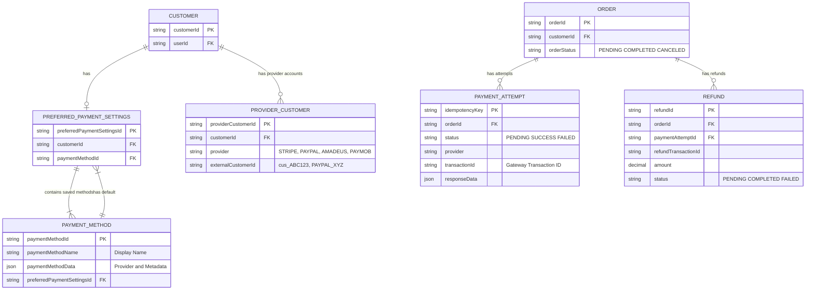
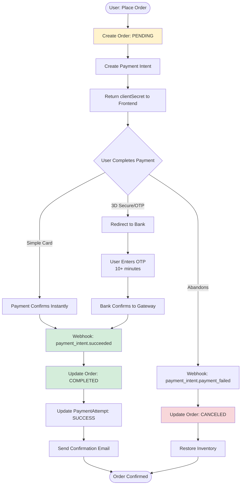
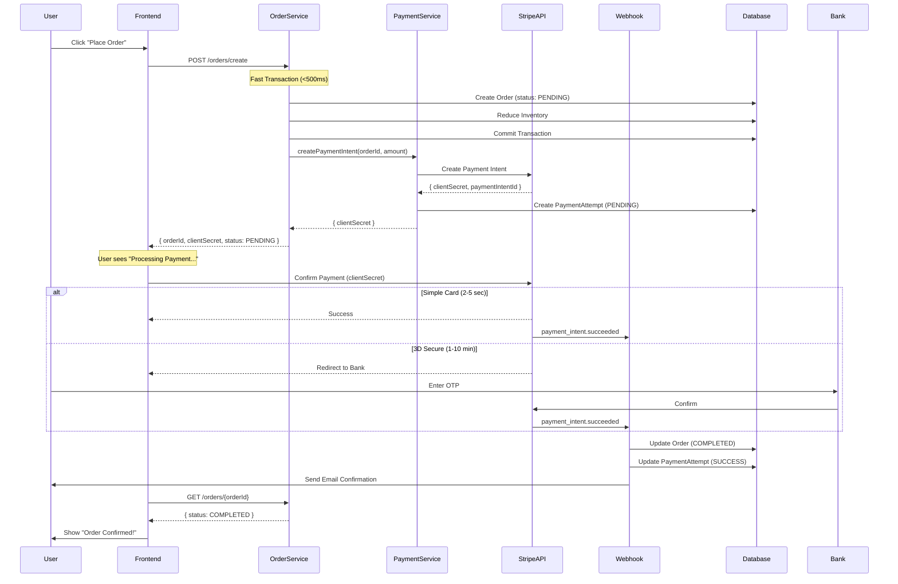
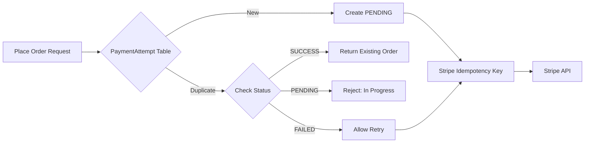
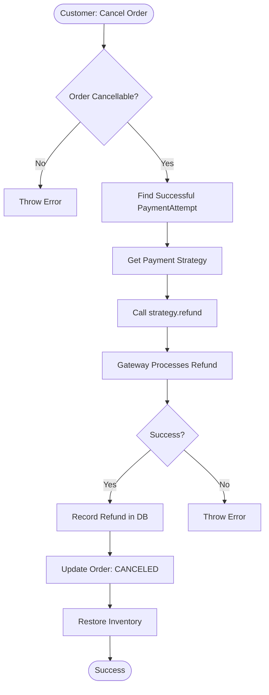

# Payment Gateway Integration - Technical Design Document

**Date:** 2026-02-08  
**Purpose:** Multi-Gateway Payment Integration using Strategy Pattern with Async Architecture  
**Scope:** Stripe, PayPal, Amadeus, Paymob, Cash on Delivery

---

## 1. Overview

This document outlines the technical design for integrating multiple payment gateways into the food delivery application using **asynchronous payment processing** with webhooks.

### Key Features
- ✅ Multiple payment providers (Stripe, PayPal, Amadeus, Paymob, COD)
- ✅ **Async payment processing** (Payment Intents + Webhooks)
- ✅ Global banking system support (3D Secure, OTP, bank transfers)
- ✅ Idempotency protection (prevents duplicate charges)
- ✅ Transaction-safe architecture
- ✅ Provider-agnostic customer management
- ✅ Clean Architecture (Repository/Service pattern)

### Critical Architectural Decision: Async-First

**Why Async?**
- **Real-world payment times**: 10-15 seconds minimum, up to 10+ minutes for OTP
- **Database transaction limits**: Cannot hold locks for minutes
- **Global compliance**: EU PSD2 requires 3D Secure (async by design)
- **Banking variance**: Different countries have different processing speeds

---

## 2. Entity Relationship Diagram



**Key Points:**
- `ProviderCustomer` maps customers to provider-specific IDs (scalable for any number of providers)
- `OrderStatusKey` is payment-specific: PENDING (awaiting payment), COMPLETED (paid), CANCELED
- `OrderTracking.trackingStatus` (JSON) handles fulfillment: preparing, received, outForDelivery, delivered
- `PaymentAttempt` tracks async payment lifecycle

---

## 3. Async Payment Flow (Payment Intents)



**Critical Differences from Sync:**
- Order created **immediately** with status PENDING
- Payment confirmation happens **asynchronously** via webhook
- Database transaction does NOT wait for payment
- Supports 10+ minute payment flows (OTP, bank transfers)

---

## 4. Complete Order Placement Sequence



---

## 5. Strategy Pattern Implementation

### Interface Definition

```typescript
interface PaymentIntentResult {
    clientSecret: string;
    paymentIntentId: string;
}

interface PaymentResult {
    success: boolean;
    transactionId?: string;
    message?: string;
}

interface RefundResult {
    success: boolean;
    refundId: string;
    message?: string;
}

interface IPaymentStrategy {
    // NEW: Create payment intent (async flow)
    createPaymentIntent(
        amount: number,
        metadata: any,
        idempotencyKey: string
    ): Promise<PaymentIntentResult>;
    
    // LEGACY: For webhook confirmation
    confirmPayment(
        paymentIntentId: string
    ): Promise<PaymentResult>;
    
    refund(
        transactionId: string,
        amount: number
    ): Promise<RefundResult>;
}
```

### Stripe Strategy (Payment Intents)

```typescript
class StripeStrategy implements IPaymentStrategy {
    async createPaymentIntent(
        amount: number,
        metadata: any,
        idempotencyKey: string
    ): Promise<PaymentIntentResult> {
        // 1. Get or create Stripe customer
        const stripeCustomerId = await providerCustomerService.getOrCreateStripeCustomer(
            metadata.customerId,
            metadata.email
        );
        
        // 2. Create payment intent
        const paymentIntent = await stripe.paymentIntents.create({
            amount: Math.round(amount * 100), // Convert to cents
            currency: 'usd',
            customer: stripeCustomerId,
            metadata: { 
                orderId: metadata.orderId,
                customerId: metadata.customerId
            },
            automatic_payment_methods: { enabled: true }
        }, { idempotencyKey });
        
        return {
            clientSecret: paymentIntent.client_secret,
            paymentIntentId: paymentIntent.id
        };
    }
    
    async confirmPayment(paymentIntentId: string): Promise<PaymentResult> {
        const paymentIntent = await stripe.paymentIntents.retrieve(paymentIntentId);
        
        return {
            success: paymentIntent.status === 'succeeded',
            transactionId: paymentIntent.id,
            message: `Payment ${paymentIntent.status}`
        };
    }

    async refund(transactionId: string, amount: number): Promise<RefundResult> {
        const refund = await stripe.refunds.create({
            payment_intent: transactionId,
            amount: Math.round(amount * 100)
        });
        
        return { 
            success: refund.status === 'succeeded', 
            refundId: refund.id 
        };
    }
}
```

---

## 6. Provider Customer Management

### ProviderCustomerService

```typescript
class ProviderCustomerService {
    async getOrCreateStripeCustomer(
        customerId: string,
        email: string
    ): Promise<string> {
        // Check if exists
        const existing = await prisma.providerCustomer.findUnique({
            where: {
                customerId_provider: {
                    customerId,
                    provider: "STRIPE"
                }
            }
        });
        
        if (existing) {
            return existing.externalCustomerId;
        }
        
        // Create new Stripe customer
        const stripeCustomer = await stripe.customers.create({
            email,
            metadata: { internalCustomerId: customerId }
        });
        
        // Save to database
        await prisma.providerCustomer.create({
            data: {
                customerId,
                provider: "STRIPE",
                externalCustomerId: stripeCustomer.id
            }
        });
        
        return stripeCustomer.id;
    }
}
```

**Benefits:**
- Zero nulls in Customer table
- Supports unlimited providers (Stripe, PayPal, Amadeus, Paymob, etc.)
- No schema changes when adding providers

---

## 7. Webhook Handler

### Critical Component for Async Payments

```typescript
class WebhookController {
    async handleStripeWebhook(req: Request, res: Response) {
        const sig = req.headers['stripe-signature'];
        const webhookSecret = process.env.STRIPE_WEBHOOK_SECRET;
        
        try {
            // Verify signature (prevents fake webhooks)
            const event = stripe.webhooks.constructEvent(
                req.body,
                sig,
                webhookSecret
            );
            
            switch (event.type) {
                case 'payment_intent.succeeded':
                    await this.handlePaymentSuccess(event.data.object);
                    break;
                case 'payment_intent.payment_failed':
                    await this.handlePaymentFailure(event.data.object);
                    break;
                case 'charge.refunded':
                    await this.handleRefund(event.data.object);
                    break;
            }
            
            res.json({ received: true });
        } catch (err) {
            res.status(400).send(`Webhook Error: ${err.message}`);
        }
    }
    
    private async handlePaymentSuccess(paymentIntent: any) {
        const orderId = paymentIntent.metadata.orderId;
        
        // Update order status
        await orderRepository.updateOrderStatus({
            orderId,
            newOrderStatus: OrderStatusKey.COMPLETED
        });
        
        // Update payment attempt
        await paymentAttemptRepository.finalizeAttempt(
            `order_${orderId}`,
            true,
            paymentIntent.id,
            { amount: paymentIntent.amount / 100 }
        );
        
        // Async actions
        await sendConfirmationEmail(orderId);
        await notifyRestaurant(orderId);
    }
    
    private async handlePaymentFailure(paymentIntent: any) {
        const orderId = paymentIntent.metadata.orderId;
        
        // Cancel order
        await orderRepository.updateOrderStatus({
            orderId,
            newOrderStatus: OrderStatusKey.CANCELED
        });
        
        // Update payment attempt
        await paymentAttemptRepository.finalizeAttempt(
            `order_${orderId}`,
            false,
            paymentIntent.id,
            { error: paymentIntent.last_payment_error }
        );
        
        // Restore inventory
        await menuItemService.restoreStock(orderId);
    }
}
```

---

## 8. Order Status Model

### Payment Status (OrderStatusKey)

```prisma
enum OrderStatusKey {
  PENDING    // Order created, payment in progress
  COMPLETED  // Payment succeeded
  CANCELED   // Payment failed or order cancelled
}
```

**Usage:**
- `PENDING`: Order created, waiting for webhook confirmation
- `COMPLETED`: Webhook confirmed payment success
- `CANCELED`: Payment failed or customer cancelled

### Fulfillment Status (OrderTracking)

```prisma
model OrderTracking {
  orderTrackingId  String   @id
  orderId          String
  trackingStatus   Json     // { status: "preparing" | "received" | "outForDelivery" | "delivered" }
}
```

**Separation of Concerns:**
- `OrderStatusKey`: Payment lifecycle
- `OrderTracking.trackingStatus`: Fulfillment lifecycle

---

## 9. Idempotency Architecture

### Two-Layer Protection



**Idempotency Keys:**
- Internal: `cart_${customerId}_${restaurantId}`
- Stripe: `order_${orderId}`

---

## 10. Refund Architecture

### Flow



### Implementation

```typescript
class RefundService {
    async refundOrder(orderId: string): Promise<void> {
        // Find successful payment
        const attempt = await prisma.paymentAttempt.findFirst({
            where: { 
                orderId,
                status: PaymentAttemptStatus.SUCCESS
            }
        });

        if (!attempt) {
            throw BadRequestError("No successful payment found");
        }

        // Get strategy and process refund
        const strategy = PaymentStrategyFactory.getStrategy(attempt.provider);
        const result = await strategy.refund(
            attempt.transactionId,
            order.totalAmount
        );

        // Record refund
        await prisma.refund.create({
            data: {
                orderId,
                paymentAttemptId: attempt.idempotencyKey,
                refundTransactionId: result.refundId,
                amount: order.totalAmount,
                status: result.success ? 'COMPLETED' : 'FAILED',
                provider: attempt.provider
            }
        });

        if (!result.success) {
            throw InternalServerError("Refund failed at gateway");
        }
    }
}
```

---

## 11. Database Schema

### New Models

```prisma
model ProviderCustomer {
  providerCustomerId String   @id @default(uuid())
  customerId         String
  provider           String   // "STRIPE", "PAYPAL", "AMADEUS", "PAYMOB"
  externalCustomerId String   // "cus_ABC123", "PAYPAL_XYZ"
  
  createdAt DateTime @default(now())
  updatedAt DateTime @updatedAt
  
  customer Customer @relation(fields: [customerId], references: [customerId])
  
  @@unique([customerId, provider])
  @@index([provider])
  @@map("provider_customers")
}

model PaymentAttempt {
  idempotencyKey String   @id
  orderId        String?
  status         PaymentAttemptStatus
  provider       String
  transactionId  String?
  responseData   Json?
  
  createdAt DateTime @default(now())
  updatedAt DateTime @updatedAt

  order Order? @relation(fields: [orderId], references: [orderId])
  
  @@index([orderId])
  @@index([status])
  @@map("payment_attempts")
}

model Refund {
  refundId            String   @id @default(uuid())
  orderId             String
  paymentAttemptId    String
  refundTransactionId String
  amount              Decimal  @db.Decimal(10, 2)
  status              RefundStatus
  provider            String
  
  createdAt DateTime @default(now())
  updatedAt DateTime @updatedAt

  order Order @relation(fields: [orderId], references: [orderId])
  
  @@index([orderId])
  @@index([status])
  @@map("refunds")
}
```

---

## 12. Testing Strategy

### Local Testing with Stripe CLI

```bash
# 1. Install Stripe CLI
stripe listen --forward-to localhost:3000/webhooks/stripe

# 2. Get webhook secret
# Copy whsec_... to .env as STRIPE_WEBHOOK_SECRET

# 3. Test payment flow
stripe trigger payment_intent.succeeded

# 4. Test failure
stripe trigger payment_intent.payment_failed
```

### Test Cards

| Card Number | Scenario | Time |
|-------------|----------|------|
| 4242 4242 4242 4242 | Success (instant) | 2-5 sec |
| 4000 0025 0000 3155 | 3D Secure required | 1-5 min |
| 4000 0000 0000 0002 | Decline | Instant |

---

## 13. Environment Variables

```bash
# Stripe
STRIPE_SECRET_KEY=sk_test_...
STRIPE_PUBLISHABLE_KEY=pk_test_...
STRIPE_WEBHOOK_SECRET=whsec_...

# PayPal (future)
PAYPAL_CLIENT_ID=...
PAYPAL_CLIENT_SECRET=...

# Amadeus (future)
AMADEUS_API_KEY=...

# Paymob (future)
PAYMOB_API_KEY=...
```

---

## 14. Migration from Sync to Async

### Key Changes

| Component | Before (Sync) | After (Async) |
|-----------|--------------|---------------|
| **OrderService** | Payment in transaction | Payment outside transaction |
| **Order Status** | Created only if paid | Created as PENDING |
| **Payment Confirmation** | Immediate | Via webhook |
| **Frontend** | Wait for response | Poll status or websocket |
| **Transaction Time** | 10+ seconds (timeout risk) | <500ms (no payment wait) |

---

## 15. Future Enhancements

- [ ] Saved payment methods (one-click checkout)
- [ ] Partial refunds
- [ ] Subscription support
- [ ] Dispute/chargeback handling
- [ ] Payment analytics dashboard
- [ ] Multi-currency support
- [ ] Payment installments

---

## Questions for Discussion

1. **Frontend Polling**: Should we use polling or WebSockets for order status updates?
2. **Timeout Handling**: How long should frontend wait before showing "Payment Processing" message?
3. **Failed Payment UX**: Should we auto-retry failed payments or require user action?
4. **Provider Fallback**: Should we support fallback providers if primary fails?
5. **Monitoring**: What metrics should we track for payment health?
