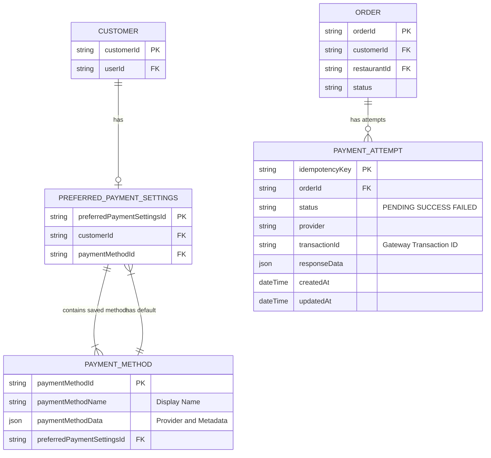
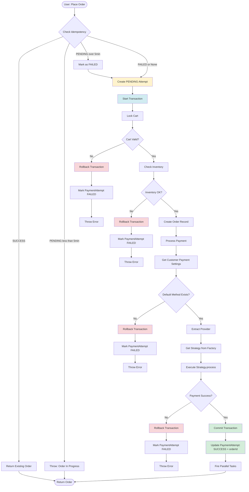
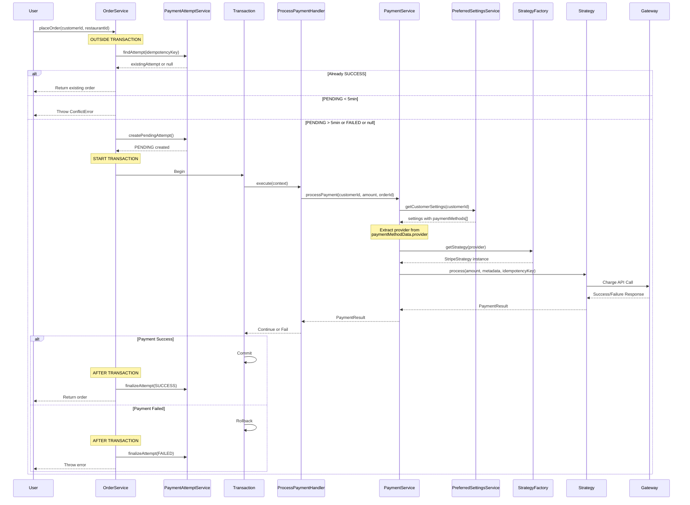
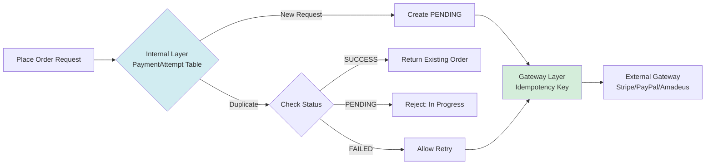
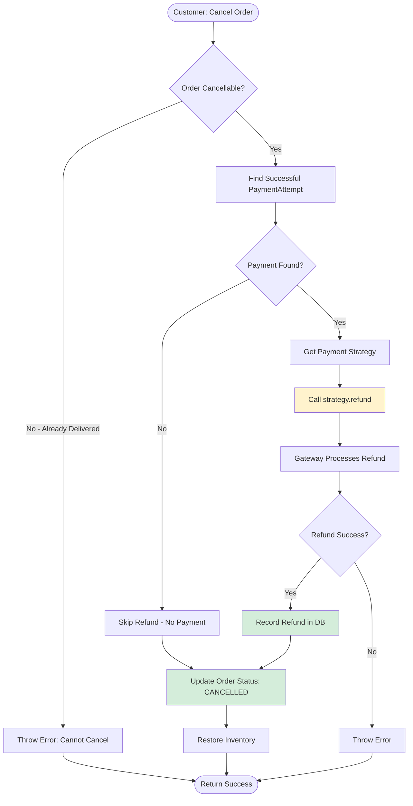

# Payment Gateway Integration - Technical Design Document

**Date:** 2026-02-06  
**Purpose:** Multi-Gateway Payment Integration using Strategy Pattern  
**Scope:** Stripe, PayPal, Amadeus, Cash on Delivery

---

## 1. Overview

This document outlines the technical design for integrating multiple payment gateways into the food delivery application. The solution uses the **Strategy Pattern** to support multiple providers while maintaining clean architecture principles.

### Key Features
- ✅ Multiple payment providers (Stripe, PayPal, Amadeus, COD)
- ✅ Idempotency protection (prevents duplicate charges)
- ✅ Transaction-safe architecture
- ✅ Timestamp consistency for audit trails
- ✅ Clean Architecture (Repository/Service pattern)

---

## 2. Entity Relationship Diagram

The following diagram shows how payment data is structured in the database:



**Key Points:**
- `PaymentMethod.paymentMethodName` = User-friendly display name
- `PaymentMethod.paymentMethodData.provider` = Actual gateway identifier
- `PaymentAttempt` tracks idempotency and prevents duplicate payments

---

## 3. Complete Order Placement Flow

This flowchart shows the **entire** order placement process, including payment:



**Critical Architecture Note:**
- `PaymentAttempt` is created **BEFORE** the transaction
- Transaction rollback does **NOT** delete the `PaymentAttempt`
- This enables idempotency across retries

---

## 4. Payment Processing Sequence Diagram

Detailed interaction between components during payment:



---

## 5. Strategy Pattern Implementation

### Interface Definition

```typescript
interface PaymentResult {
    success: boolean;
    transactionId?: string;
    message?: string;
}

interface RefundResult {
    success: boolean;
    refundId: string;
    message?: string;
}

interface IPaymentStrategy {
    process(
        amount: number, 
        metadata: any, 
        idempotencyKey: string
    ): Promise<PaymentResult>;
    
    refund(
        transactionId: string,
        amount: number
    ): Promise<RefundResult>;
}
```

### Strategy Implementations

```typescript
class StripeStrategy implements IPaymentStrategy {
    async process(amount: number, metadata: any, idempotencyKey: string): Promise<PaymentResult> {
        // Stripe SDK integration
        const stripe = new Stripe(process.env.STRIPE_SECRET_KEY);
        const charge = await stripe.charges.create({
            amount: amount * 100, // Convert to cents
            currency: 'usd',
            customer: metadata.customerId,
            source: metadata.cardToken,
            idempotency_key: idempotencyKey
        });
        
        return { 
            success: charge.status === 'succeeded', 
            transactionId: charge.id 
        };
    }

    async refund(transactionId: string, amount: number): Promise<RefundResult> {
        const stripe = new Stripe(process.env.STRIPE_SECRET_KEY);
        const refund = await stripe.refunds.create({
            charge: transactionId,
            amount: amount * 100
        });
        
        return { 
            success: refund.status === 'succeeded', 
            refundId: refund.id 
        };
    }
}

class PayPalStrategy implements IPaymentStrategy {
    async process(amount: number, metadata: any, idempotencyKey: string): Promise<PaymentResult> {
        // PayPal SDK integration
        // Similar implementation with PayPal API
        return { success: true, transactionId: "pp_123" };
    }

    async refund(transactionId: string, amount: number): Promise<RefundResult> {
        // PayPal refund API call
        return { success: true, refundId: "pp_refund_123" };
    }
}

class AmadeusStrategy implements IPaymentStrategy {
    async process(amount: number, metadata: any, idempotencyKey: string): Promise<PaymentResult> {
        // Amadeus SDK integration
        return { success: true, transactionId: "ama_123" };
    }

    async refund(transactionId: string, amount: number): Promise<RefundResult> {
        // Amadeus refund API call
        return { success: true, refundId: "ama_refund_123" };
    }
}

class CashOnDeliveryStrategy implements IPaymentStrategy {
    async process(amount: number, metadata: any, idempotencyKey: string): Promise<PaymentResult> {
        // No external gateway - payment collected on delivery
        return { 
            success: true, 
            transactionId: `cod_${idempotencyKey}` 
        };
    }

    async refund(transactionId: string, amount: number): Promise<RefundResult> {
        // No actual refund needed - payment wasn't collected yet
        return { 
            success: true, 
            refundId: `cod_refund_${Date.now()}` 
        };
    }
}
```

### Factory Pattern

```typescript
class PaymentStrategyFactory {
    static getStrategy(provider: string): IPaymentStrategy {
        switch(provider.toUpperCase()) {
            case 'STRIPE': 
                return new StripeStrategy();
            case 'PAYPAL': 
                return new PayPalStrategy();
            case 'AMADEUS': 
                return new AmadeusStrategy();
            case 'CASH_ON_DELIVERY': 
                return new CashOnDeliveryStrategy();
            default: 
                throw BadRequestError(`Unsupported payment provider: ${provider}`);
        }
    }
}
```

---

## 6. Idempotency Architecture

### Problem Statement
If a user clicks "Place Order" twice, or the network retries, we must prevent:
- Duplicate orders
- Double charging the customer
- Inventory being reduced twice

### Solution: Two-Layer Idempotency



**Key Points:**
1. **Internal Layer** (`PaymentAttempt` table):
   - Created **outside** transaction
   - Survives rollbacks
   - Uses `cart_${customerId}_${restaurantId}` as key
   
2. **Gateway Layer** (Stripe/PayPal):
   - Idempotency key passed to gateway
   - Prevents double-charging if we timeout
   - Uses `order_${orderId}` as key

3. **Stale PENDING Timeout**:
   - PENDING attempts older than 5 minutes auto-fail
   - Prevents orphaned records from blocking retries

---

## 7. Transaction Architecture

### Critical Design Decision

```
❌ WRONG: PaymentAttempt inside transaction
┌─────────────────────────────────────┐
│ Transaction                         │
│  1. Create Order                    │
│  2. Create PaymentAttempt (PENDING) │
│  3. Process Payment → FAILS         │
│  4. ROLLBACK                        │
└─────────────────────────────────────┘
Result: PaymentAttempt deleted → No idempotency!

✅ CORRECT: PaymentAttempt outside transaction
1. Create PaymentAttempt (PENDING) ← Outside
┌─────────────────────────────────────┐
│ Transaction                         │
│  2. Create Order                    │
│  3. Process Payment → FAILS         │
│  4. ROLLBACK                        │
└─────────────────────────────────────┘
5. Update PaymentAttempt (FAILED) ← Outside
Result: PaymentAttempt preserved → Idempotency works!
```

---

## 8. Timestamp Consistency

All database writes in the order placement chain use the same `requestTimestamp`:

```typescript
// In OrderService.placeOrder()
const requestTimestamp = new Date(); // Set once

// Passed to all operations
context.requestTimestamp = requestTimestamp;

// Used in all repositories
await orderRepository.create({ 
    ...data, 
    createdAt: requestTimestamp 
});

await paymentAttemptRepository.create({ 
    ...data, 
    createdAt: requestTimestamp 
});
```

**Benefits:**
- Perfect correlation for audit trails
- Easier debugging (all related records have identical timestamps)
- Compliance requirements

---

## 9. Error Handling

All services use standardized error factories:

```typescript
import { 
    NotFoundError, 
    ConflictError, 
    InternalServerError,
    UnprocessableEntityError,
    BadRequestError
} from '../utils/errors/error-factories';

// Example usage
if (!selectedMethod) {
    throw NotFoundError("Default payment method");
}

if (existingAttempt.status === 'PENDING') {
    throw ConflictError("Order placement in progress");
}
```

---

## 10. Clean Architecture Layers

```
┌─────────────────────────────────────────┐
│          Handlers (Order Chain)         │
│  ProcessPaymentHandler, CreateOrder...  │
└──────────────────┬──────────────────────┘
                   │
┌──────────────────▼──────────────────────┐
│            Services Layer               │
│  OrderService, PaymentService,          │
│  PaymentAttemptService, etc.            │
└──────────────────┬──────────────────────┘
                   │
┌──────────────────▼──────────────────────┐
│         Repositories Layer              │
│  OrderRepository, PaymentAttemptRepo... │
└──────────────────┬──────────────────────┘
                   │
┌──────────────────▼──────────────────────┐
│          Database (Prisma)              │
└─────────────────────────────────────────┘
```

**Rules:**
- Handlers call Services (never Repositories directly)
- Services call other Services or Repositories
- Repositories only interact with the database
- Each model has its own Repository and Service

---

## 11. Database Schema Changes

### New Enum
```prisma
enum PaymentAttemptStatus {
  PENDING
  SUCCESS
  FAILED
}
```

### New Model
```prisma
model PaymentAttempt {
  idempotencyKey String   @id @map("idempotency_key")
  orderId        String?  @map("order_id")  // Nullable - set after order creation
  status         PaymentAttemptStatus @map("status")
  provider       String   @map("provider")
  transactionId  String?  @map("transaction_id")
  responseData   Json?    @map("response_data")
  
  createdAt      DateTime @default(now()) @map("created_at")
  updatedAt      DateTime @updatedAt @map("updated_at")

  order Order? @relation(fields: [orderId], references: [orderId])

  @@index([orderId])
  @@index([status])
  @@index([createdAt])
  @@map("payment_attempts")
}
```

### Refund Model
```prisma
enum RefundStatus {
  PENDING
  COMPLETED
  FAILED
}

model Refund {
  refundId            String   @id @default(uuid()) @map("refund_id")
  orderId             String   @map("order_id")
  paymentAttemptId    String   @map("payment_attempt_id")
  refundTransactionId String   @map("refund_transaction_id")
  amount              Decimal  @map("amount") @db.Decimal(10, 2)
  status              RefundStatus @map("status")
  provider            String   @map("provider")
  
  createdAt           DateTime @default(now()) @map("created_at")
  updatedAt           DateTime @updatedAt @map("updated_at")

  order Order @relation(fields: [orderId], references: [orderId])

  @@index([orderId])
  @@index([status])
  @@map("refunds")
}
```

### Updated Model
```prisma
model Order {
  // ... existing fields
  paymentAttempts PaymentAttempt[]
  refunds         Refund[]
}
```

---

## 12. Refund Architecture (Order Cancellation)

### Use Case
When a customer cancels an order before it's prepared/delivered, the system must refund the payment.

### Refund Flow



### RefundService Implementation

```typescript
class RefundService {
    constructor(
        private paymentAttemptService: PaymentAttemptService
    ) {}

    async refundOrder(orderId: string): Promise<void> {
        // 1. Find successful payment
        const attempts = await prisma.paymentAttempt.findMany({
            where: { 
                orderId,
                status: PaymentAttemptStatus.SUCCESS
            }
        });

        if (attempts.length === 0) {
            throw BadRequestError("No successful payment found");
        }

        const attempt = attempts[0];

        // 2. Get strategy and process refund
        const strategy = PaymentStrategyFactory.getStrategy(attempt.provider);
        const refundResult = await strategy.refund(
            attempt.transactionId,
            attempt.responseData.amount
        );

        // 3. Record refund
        await prisma.refund.create({
            data: {
                orderId,
                paymentAttemptId: attempt.idempotencyKey,
                refundTransactionId: refundResult.refundId,
                amount: attempt.responseData.amount,
                status: refundResult.success ? 'COMPLETED' : 'FAILED',
                provider: attempt.provider
            }
        });

        if (!refundResult.success) {
            throw InternalServerError("Refund failed at gateway");
        }
    }
}
```

### Integration with OrderService

```typescript
class OrderService {
    async cancelOrder(orderId: string, customerId: string) {
        const order = await orderRepository.findOrderById(orderId);
        
        // Validation
        if (!order) throw NotFoundError("Order not found");
        if (order.customerId !== customerId) throw ForbiddenError("Not your order");
        if (order.status === 'DELIVERED') throw BadRequestError("Cannot cancel delivered order");
        
        // 1. Process refund
        await refundService.refundOrder(orderId);
        
        // 2. Update order status
        await orderRepository.updateOrderStatus({
            orderId,
            status: OrderStatusKey.CANCELLED
        });
        
        // 3. Restore inventory
        await inventoryService.restoreInventory(orderId);
        
        return { message: "Order cancelled and refund processed" };
    }
}
```

### Key Points

- **Synchronous Processing**: Refunds are processed immediately (no webhooks needed)
- **Strategy Pattern**: Each payment provider implements its own refund logic
- **Cash on Delivery**: No actual refund needed (payment not collected)
- **Audit Trail**: All refunds recorded in `Refund` table
- **Idempotent**: Multiple cancel attempts won't create duplicate refunds

---

## 13. Testing Strategy

### Unit Tests
- `PaymentStrategyFactory` - verify correct strategy instantiation
- Each strategy - mock gateway calls
- `PaymentAttemptService` - idempotency logic

### Integration Tests
- Full order placement flow with test payment methods
- Idempotency verification (double-click simulation)
- Rollback scenarios

### Manual Testing
1. Setup test payment methods in database
2. Place order via API
3. Verify payment attempt records
4. Test retry scenarios
5. Verify parallel handlers execute

---

## 14. Future Enhancements

- [ ] Webhook handlers for async payment confirmations (bank transfers, ACH)
- [ ] Partial refunds (refund only some items)
- [ ] Payment method management UI
- [ ] Analytics dashboard for payment success rates
- [ ] Automated reconciliation with gateway reports
- [ ] Support for payment installments
- [ ] Dispute/chargeback handling

---

## Questions for Discussion

1. **Retry Strategy**: Should we add exponential backoff for network errors?
2. **Timeout Values**: Is 5 minutes appropriate for stale PENDING cleanup?
3. **Provider Priority**: Should we support fallback providers if primary fails?
4. **Monitoring**: What metrics should we track for payment health?
5. **Security**: Do we need additional encryption for `paymentMethodData`?
